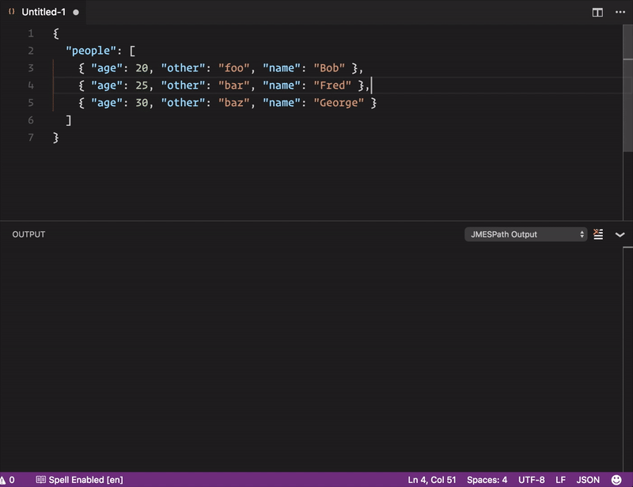

# JMESPath for Visual Studio Code

JMESPath (pronounced "james path") is a query language for JSON which allows one to extract and transform elements from a JSON document.

This extension lets you test JMESPath expressions from within Visual Studio Code.

For more information about JMESPath, please visit [here](http://jmespath.org)

## Features

This extension depends on the [JavaScript implementation of JMESPath](https://github.com/jmespath/jmespath.js) which is fully compliant with latest [specification](http://jmespath.org/specification.html).

## How to use this extension

This extension adds `JMESPath: Query JSON` command to the command palette.

To use the extension:

- Open a JSON document
- Run `JMESPath: Query JSON` command from command palette (`F1` on Windows or `Cmd+Shift+P` on Mac)
- Enter JMESPath expression
- Expression output will be shown in `JMESPath Output` window

## Release Notes

### 0.0.1

- Initial release

